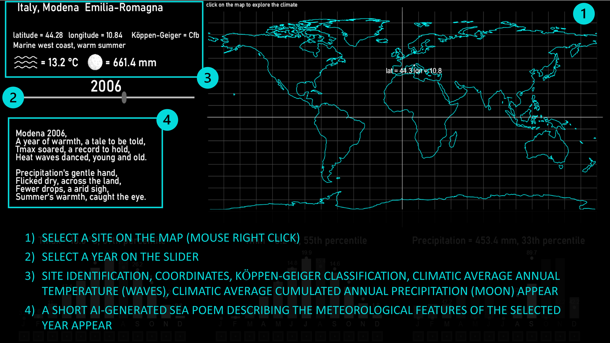
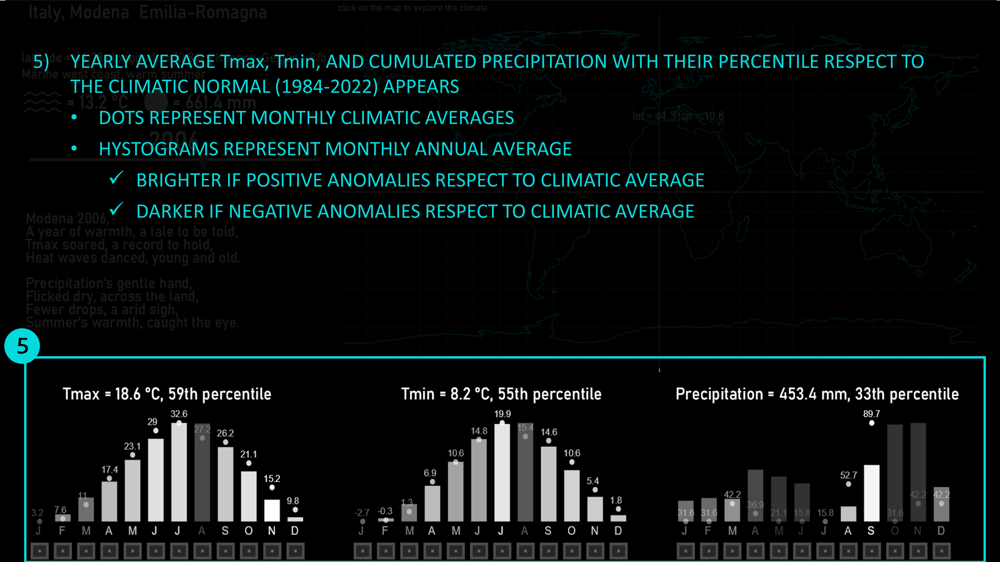
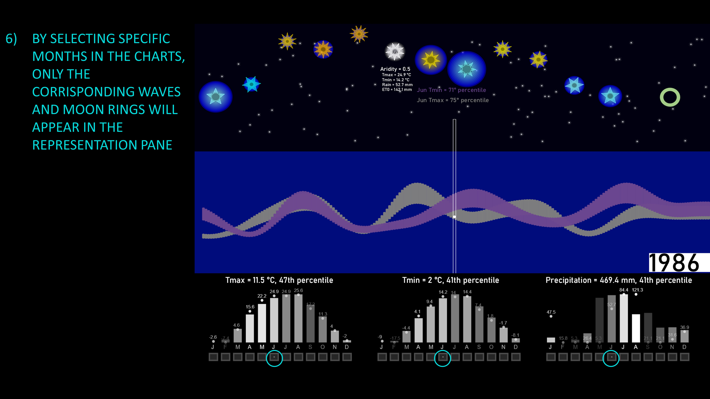
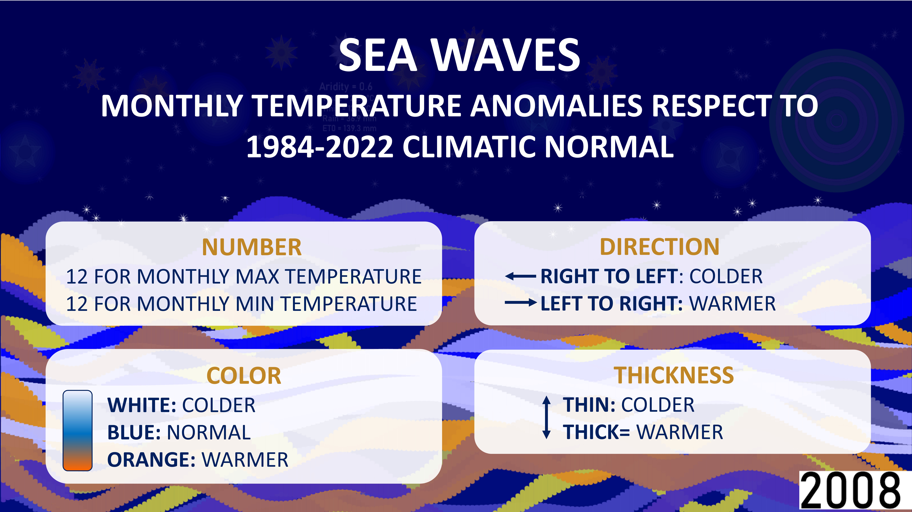
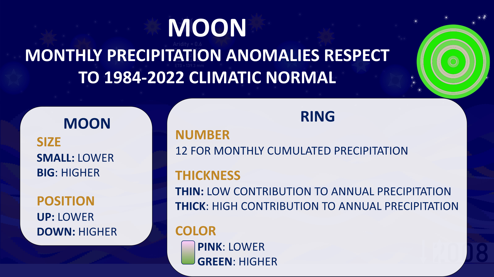
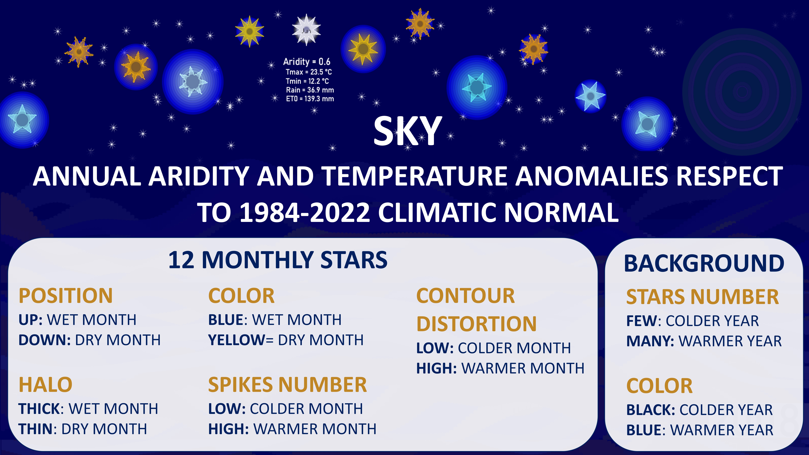
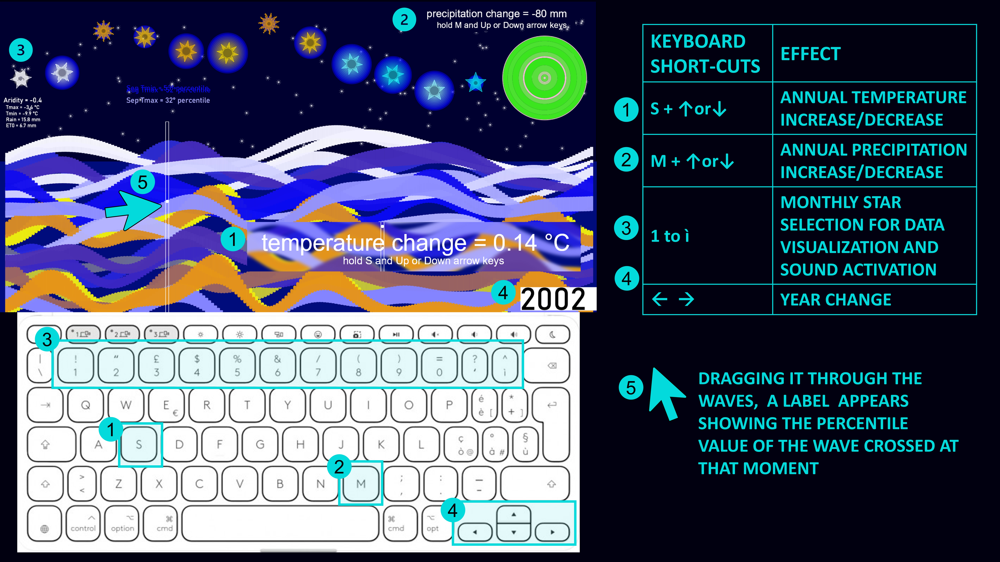

# 🌊 **SEAMAN: Synthesized EArth Monthly ANomalies** 🌊

## Table of Contents
1. [Introduction](#introduction)
2. [Features](#features)
3. [Installation](#installation)
4. [Usage](#usage)
5. [Key Components](#key-components)
6. [Customizations](#customizations)
7. [Contributing](#contributing)
8. [License](#license)

---

## Introduction
**SEAMAN** is an innovative climate data visualization tool that translates [**NASA-Power**](https://power.larc.nasa.gov/) data (1984-2022) into an interactive digital seascape. Designed to enhance climate change communication, SEAMAN transforms complex climate data into an intuitive, symbolic experience for educators, researchers, policymakers, and general audiences. The sea, moon, stars, and sky represent various climate variables, making it easier to grasp global trends and localized impacts.

---

## Features
- 🌍 **Global Scope**: Retrieve and visualize climate data for any location worldwide.
- 🌊 **Temperature Trends**: Represented by waves’ color, movement, thickness and sound.
- 🌕 **Precipitation Patterns**: Depicted through the moon's size and position.
- ⭐ **Aridity Indicators**: Conveyed by a constellation of stars.
- 🎧 **Interactive Soundscape**: Dynamic, evolving auditory elements tied to climate anomalies.
- 🖥️ **Visual & Auditory Metaphors**: Transform data into an immersive, multi-sensory experience.

---

## Installation
1. **Download the repository** [here]([https://github.com/[your-username]/seaman/archive/refs/heads/main.zip](https://github.com/GeoModelLab/seaman)).
2. **Navigate to the folder** and locate `seaman.exe` to launch the software.
3. To explore the source code, navigate to the `/src` folder.

---

## Usage
Launch SEAMAN by opening `seaman.exe`. The software allows users to:

- **Choose a location**: Navigate by entering geographic coordinates, city, or country.
- **Select a year**: View climate data from 1984 to 2022.
- **Interact**: Use the mouse and keyboard to explore the seascape, viewing temperature and precipitation anomalies.

---

## Key Components

### Navigation pane
🌍📶 Retrieve and visualize climate data for any location worldwide, selecting a year from 1984 to 2022.

### Representation pane

#### 🌊 The Sea
- **Represents**: Air temperature trends.
- **Visuals**: Wave color, thickness and movement shift with temperature anomalies.Temperature anomaly of each wave (expressed as percentile respect to the climatic normal) appears on the screen by hovering it with the pointer (see shortcuts (crea collegamento)).
- **Sound**: Waves produce sounds, with intensity and rhythm mirroring thermal variations (see [Soundscape](#soundscape)).
- **Climatic scenario exploration**: User can explore different temperature scenarios acting on keyboard (see [Shortcuts](#shortcuts)).

#### 🌕 The Moon
- **Represents**: Monthly and annual precipitation.
- **Visuals**: Moon size and position adjust based on rainfall patterns.
- **Climatic scenario exploration**: User can explore different precipitation scenarios acting on keyboard (see [Shortcuts](#shortcuts)).

#### 🌠 The Sky

&nbsp;&nbsp;&nbsp;**⭐ The stars**

&nbsp;&nbsp;&nbsp;- **Represents**: Aridity levels and temperature anomalies.  
&nbsp;&nbsp;&nbsp;- **Visuals**: Twelve stars form months' constellation that vary:  
&nbsp;&nbsp;&nbsp;&nbsp;&nbsp;&nbsp;1. In position, color, and brightness based on precipitation anomalies.  
&nbsp;&nbsp;&nbsp;&nbsp;&nbsp;&nbsp;2. In spike number and contour based on temperature anomalies.  
&nbsp;&nbsp;&nbsp;Acting on the keyboard, each star can be selected to show aridity feature of that month (see [Shortcuts](#shortcuts)).  
&nbsp;&nbsp;&nbsp;- **Sound**: Each star produces sounds when selected, with distortion intensity mirroring aridity variations (see [Soundscape](#soundscape)).

&nbsp;&nbsp;&nbsp;**🌌 The background sky and stars**

&nbsp;&nbsp;&nbsp;- **Represents**: Temperature anomalies.  
&nbsp;&nbsp;&nbsp;- **Visuals**: The number of stars and sky brightness increase with positive temperature anomalies (temperature rise).

#### 🎧 Soundscape
- **Dynamic Elements**: Synth loops, drums, and melodies respond to temperature data, with patterns growing more intense and discordant as conditions worsen.

#### ⌨ Shortcuts
User can act on keyboard to:
1. Explore temperature and precipitation scenarios 
2. Select a and activate a monthly star, showing and playing its aridity feature

---

## Customizations
SEAMAN is developed using [vvvv](https://vvvv.org/), a visual programming environment that enables users to create and manipulate interactive content. Users can customize various elements of the software, including colors, sounds, and visuals, by modifying the patch. This flexibility allows for a personalized experience, making it easier to adapt SEAMAN to individual preferences or specific educational purposes. Experiment with different configurations to enhance your understanding of climate data and its visual representations.
- Modify **soundscapes** by replacing audio files in the `/sounds` folder.
- 
---

## Contributing
We welcome contributions from the community. If you wish to contribute:
1. Fork the repository.
2. Create a new branch.
3. Commit your changes.
4. Submit a pull request.

Feel free to open an issue to discuss your ideas before implementation.

---

## License
This project is licensed under the MIT License—see the [LICENSE](LICENSE) file for details.

---

Thank you for sailing with SEAMAN as we explore the stormy seas of climate change through a symbolic, data-driven seascape.
